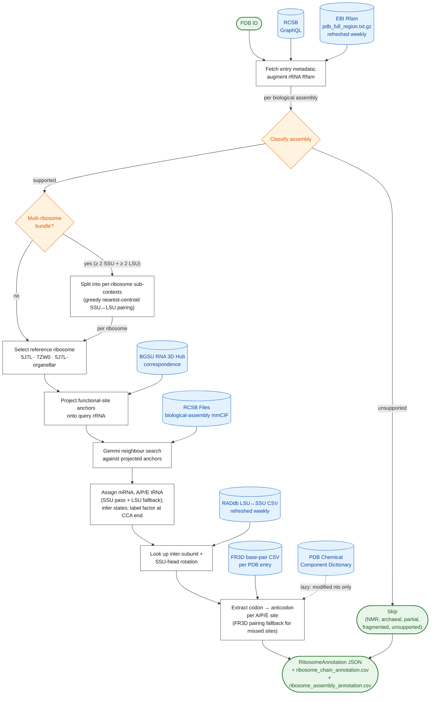

# ribosome-state-annotator

A Python package for annotating the functional state of complete
bacterial and eukaryotic ribosome assemblies from PDB entries.
Provides both a command-line interface (`ribostate`) and a Python
library (`import ribosome_state_annotator`).

## Status

Version 1, pre-release. The full design specification is in
[`ribosome_functional_annotation_package_spec_v3.md`](./ribosome_functional_annotation_package_spec_v3.md).

## Overview

### Biological context

The ribosome is the macromolecular machine that translates messenger
RNA into protein. During translation it cycles through structurally
distinct functional states — initiation, decoding, peptide-bond
formation, translocation, termination, and recycling — each
characterised by a specific arrangement of mRNA, transfer RNAs, and
auxiliary protein factors (e.g. EF-Tu, EF-G, RF1/2, RRF) bound to the
small (SSU) and large (LSU) subunits. The three tRNA binding sites —
**A** (aminoacyl), **P** (peptidyl), and **E** (exit) — collectively
serve as a structural signature for the elongation-cycle stage at
which a given structure was captured.

A tRNA's functional state is reported as `<SSU>/<LSU>` — its contact
with the small-subunit site followed by its contact with the
large-subunit site:

- **Classical states** (`A/A`, `P/P`, `E/E`) — the tRNA occupies the
  same site on both subunits. These are the stable resting
  conformations before and after each round of elongation.
- **Hybrid states** (`A/P`, `P/E`) — after peptide-bond formation but
  prior to translocation, the acceptor end of each tRNA spontaneously
  moves into the next LSU site while the anticodon end remains on
  the SSU. Hybrid configurations provide direct structural evidence
  of a post-peptidyl-transfer, pre-translocation intermediate.
- **Chimeric / intermediate states** — the tRNA simultaneously
  contacts two adjacent sites on at least one subunit, capturing it
  in mid-translocation. Following the Zhou *et al.* 2014 convention
  (see [`REFERENCES.md`](./REFERENCES.md)), **case denotes the
  subunit**: lowercase letters represent SSU contacts (`ap` = A+P
  on the 30S/40S body; `pe` = P+E on the 30S/40S body), uppercase
  letters represent LSU contacts (`AP`, `PE`). Either or both sides
  may carry doubled letters: `ap/A` is chimeric on the SSU only;
  `ap/AP` is fully chimeric on both subunits — the definitive
  EF-G-trapped translocation intermediate.
- **Factor-bound tRNA at the LSU** (e.g. `A/Elongation factor Tu`,
  `A/Release factor 1`, `P/Initiation factor IF-2`,
  `P/Eukaryotic translation initiation factor 5B`) — when a tRNA's
  CCA end is engaged by a non-ribosomal protein factor rather than
  docked into a canonical LSU site, the LSU half of the label is
  replaced by the factor's name. The mechanism applies symmetrically
  to both A- and P-site tRNAs: A-site labels capture EF-Tu·GTP
  ternary complexes (decoding), eEF1A complexes, and termination
  complexes (RF1/2/3, eRF1/3); P-site labels capture initiation
  complexes in which IF2 (bacteria) or eIF5B (eukaryotes) engages
  the acceptor stem of the initiator tRNA. Refer to
  [`REFERENCES.md`](./REFERENCES.md) for the canonical structures.
- **Missing-contact placeholders** — applied symmetrically to either
  half of the state string. `*` indicates the chain is **full-length
  (≥ 30 nt)** but doesn't make a canonical contact at that subunit —
  typically a positionally-displaced tRNA (e.g. a pre-accommodation
  A-tRNA whose acceptor end is at the PTC but whose anticodon end
  isn't yet paired with the mRNA, giving `*/AP`). `**` indicates the
  chain is **shorter than 30 nt** and physically cannot reach that
  subunit — anticodon-stem-loop fragments at the SSU give `<state>/**`;
  CCA-end-only tRNA analogs at the PTC (e.g. in 7RQA, 8T8C) give
  `**/<state>`. A chain that's a fragment with no anchor contact on
  either subunit (state `**/**`) is demoted to ``unmapped_rna_chains``
  rather than claiming a tRNA role.
- **Subunit-absent placeholder** (`-`) — used when the deposit is an
  **isolated subunit** (30S/40S only or 50S/60S only). An A-tRNA in a
  30S-only structure gets `A/-` (canonical A on SSU, no LSU in the
  deposit); an A-tRNA in a 50S-only structure gets `-/A`. Distinct
  from `*` (displaced) and `**` (fragment) — `-` means the missing
  half isn't physically in the assembly. See the `topology` field on
  each `RibosomeAnnotation` for the assembly-level signal.

In addition to the per-tRNA functional state, each assembly is
annotated with two **large-scale movement** metrics from the RAD
database (Mears *et al.* / RADtool): the inter-subunit body rotation
(`intersubunit_rotation`) and the SSU-head rotation
(`ssu_head_rotation`). These two angles describe the ratchet-like
inter-subunit rotation and the head-swivel that together gate
translocation, and constitute the standard descriptors used to
compare ribosome conformations across structures.

The PDB currently contains thousands of ribosome structures spanning
bacteria, archaea, and eukaryotes (cytoplasmic and organellar). Chain
naming conventions vary substantially across depositions, and
identifying which chain corresponds to the A-site tRNA, P-site tRNA,
or mRNA from a raw mmCIF is non-trivial. This package automates that
annotation.

### Method

Functional-site nucleotides on the rRNA — the residues that directly
contact mRNA, A-tRNA, P-tRNA, and E-tRNA — are among the most
phylogenetically conserved positions across all of biology. The
package leverages this conservation through a four-stage pipeline:

1. **Retrieve and classify.** Entry metadata is pulled from the RCSB
   GraphQL API, augmented with Rfam mappings from the EBI
   `pdb_full_region.txt.gz` flat file (locally cached, weekly refresh
   — see [`Rfam pdb_full_region`](#rfam-pdb_full_region-mapping) below).
   For each rRNA chain the package picks the **single highest
   bit-score** Rfam accession from the file; cross-family HMM hits
   (e.g. bacterial 16S + archaeal SSU + eukaryotic 18S all matching
   one chain) collapse to the one biologically-correct family. The
   assembly is then classified as bacterial, eukaryotic cytoplasmic,
   or eukaryotic organellar.
2. **Project reference anchors.** Curated functional-site
   nucleotides from a reference ribosome are mapped onto the query
   rRNA via the BGSU RNA correspondence API, which uses Rfam-based
   covariance alignments to identify evolutionarily equivalent
   positions across distantly related organisms. The reference set
   is picked per classification: *E. coli* 5J7L for bacterial,
   *S. cerevisiae* 7ZW0 for eukaryotic cytoplasmic, and a filtered
   variant of the *E. coli* set for organellar (4 anchors removed
   because the corresponding E. coli residues have no mt-rRNA
   equivalent; BGSU's structural alignment cross-walks the remaining
   16 to mt-12S / mt-16S residues in the deposit's native numbering).
3. **Split multi-ribosome bundles.** Some deposits pack multiple
   complete ribosomes into a single biological assembly (di-ribosomes,
   in-situ polysomes — e.g. 8R3V, 9O3L, 9B0S). When ≥ 2 SSU chains
   pair with ≥ 2 LSU chains, the assembly is split into per-ribosome
   sub-contexts by greedy nearest-centroid SSU↔LSU pairing; each
   ribosome receives its own annotation with a suffixed `assembly_id`
   (`1-1`, `1-2`, …).
4. **Detect contacts and assign.** The biological-assembly mmCIF is
   downloaded and a Gemmi neighbour search identifies the chains in
   the query structure that physically contact each set of projected
   anchors. Chains are assigned to mRNA, A-tRNA, P-tRNA, and E-tRNA
   roles by closest-anchor proximity. After the canonical SSU-anchor
   pass, an LSU-based fallback fills any unfilled A or P slot using
   `lsu_atrna` / `lsu_ptrna` proximity — this recovers tRNA analogs
   that engage only the PTC (7RQA, 8T8C) and pre-accommodation
   full tRNAs whose anticodon end hasn't yet engaged the decoding
   centre (3JAG, 7O7Z, 7OSM, 7UG7).
5. **Label states.** The SSU/LSU contact pattern of each tRNA
   determines its functional state (classical, hybrid, chimeric, or
   the fragment/displaced placeholders described above), and an
   additional neighbour search around the A- or P-tRNA's CCA end
   identifies any bound elongation, release, or initiation factor.
6. **Aggregate taxonomy.** RCSB's
   `rcsb_entity_source_organism.taxonomy_lineage` gives a full NCBI
   lineage per polymer entity. The package votes across the
   assembly's rRNA chains only — tRNAs, mRNAs, and bound factors are
   excluded because heterologous reconstitutions mix organisms — and
   returns a single consensus `AssemblyTaxonomy` per ribosome:
   strict-LCA where every rRNA chain agrees, then majority-mode
   constrained to that subtree for any deeper depths. The output
   includes `domain` (Bacteria / Eukaryota / Archaea), `species`,
   the full lineage, and an `is_mixed` flag for non-monoclonal
   assemblies.

This **contact-transfer annotation** workflow transfers functional
identity through three-dimensional contacts to conserved positions,
in preference to relying on chain names or sequence-only heuristics.

## Workflow



External data sources are shown in blue, in-package processing stages
in white, and inputs/outputs in green. A PDB entry may contain
multiple biological assemblies (e.g. 4V5Q contains two), and one
biological assembly may itself contain multiple complete ribosomes
(di-ribosomes / in-situ polysomes, e.g. 8R3V); the
classify-through-codon block executes once per ribosome, so each
ribosome receives its own functional-chain assignment, tRNA states,
motion metrics, and codon-anticodon evidence. Multi-ribosome bundles
appear in the output with suffixed assembly IDs (`1-1`, `1-2`, …);
single-ribosome assemblies keep their plain assembly ID.

## Installation

Requires Python ≥ 3.10.

```bash
git clone https://github.com/BGSU-RNA/ribosome-functional-annotation.git
cd ribosome-functional-annotation
python3 -m venv .venv
source .venv/bin/activate
pip install -e .          # runtime dependencies only
pip install -e ".[dev]"   # additionally install ruff, mypy, pytest
```

## Usage

The package provides a command-line interface (`ribostate`) and a
Python API. Both surfaces expose the same underlying functionality.

### Command-line interface

**Annotate a single PDB entry (JSON + companion CSVs in the current
directory):**

```bash
ribostate annotate 5UYM
# writes 5UYM.json, ribosome_chain_annotation.csv, ribosome_assembly_annotation.csv
```

**Specify an output destination:**

```bash
ribostate annotate 5UYM -o ./results/            # → results/5UYM.json + CSVs
ribostate annotate 5UYM -o ./results/my.json     # → results/my.json + CSVs
ribostate annotate 5UYM --stdout                 # JSON to stdout; no files written
```

**Restrict to a single biological assembly:**

```bash
ribostate annotate 4V5Q --assembly-id 1 -o ./results/
```

**Batch annotation of multiple PDB entries:**

```bash
printf "5J7L\n7ZW0\n6ZMI\n" > pdb_ids.txt
ribostate annotate-batch pdb_ids.txt
# writes batch.json + the two CSVs in the current directory. Per-PDB
# errors are logged and the batch continues; pass --abort-on-error to
# stop on the first failure.
```

**Annotate from a local mmCIF (bypassing the RCSB download):**

```bash
ribostate annotate 5UYM --input-file ./5uym-assembly1.cif
```

**Cache management:**

```bash
ribostate cache info        # report entry counts per namespace
ribostate cache clear --yes # delete the entire cache directory
ribostate raddb info        # display the cached RADdb version and download date
ribostate raddb refresh     # check for and download a newer RADdb release
```

Output-path resolution rules:

- **`-o` omitted** → writes `<PDB>.json` (single entry) or `batch.json`
  (batch) to the current directory.
- **`-o` resolves to a directory** → writes the auto-named JSON within
  that directory.
- **`-o` resolves to a file with a `.json` / `.jsonl` / `.csv` suffix**
  → writes to the specified path verbatim.

Additional command-line flags:

| Flag | Effect |
|------|--------|
| `--assembly-id N` | Restrict processing to a single biological assembly. |
| `--stdout` | Write JSON to stdout; do not create files. |
| `--no-csv` | Emit JSON only; suppress the two companion CSV files. |
| `--abort-on-error` | Halt the batch on the first per-entry error (batch only). |
| `--cutoff 5.0` | Gemmi neighbour-search cutoff in ångströms. |
| `--cache-dir PATH` | Override the default cache directory (`~/.cache/ribosome-state-annotator`). |
| `--no-cache` | Disable caching for this invocation. |
| `--strict` | Skip (rather than warn about) assemblies with low ribosomal-protein counts. |
| `--input-file PATH` | Parse a local mmCIF instead of downloading from RCSB. |
| `--refresh-raddb` | Force a check for a newer RADdb release at the start of the run (default: refresh weekly). |
| `--quiet` | Suppress INFO-level progress messages; emit warnings and errors only. |
| `--debug` | Enable DEBUG-level logging (includes HTTP traces). |

Comprehensive help is available via `ribostate --help`,
`ribostate annotate --help`, `ribostate annotate-batch --help`, and
`ribostate cache --help`.

### Python API

```python
from ribosome_state_annotator import annotate_pdb, annotate_assembly, annotate_many

# Annotate all assemblies in one PDB entry.
annotations = annotate_pdb("5J7L")

# Annotate a specific assembly.
annotation = annotate_assembly("5J7L", "1")
print(annotation.ribosome_classification)        # "bacterial_ribosome"
print(annotation.aminoacyl_trna_chain.ife)       # "5J7L|1|V"
print(annotation.aminoacyl_trna_state)           # "A/A"

# Batch processing of multiple PDB IDs (per-entry errors are caught
# by default; pass continue_on_error=False to abort on first failure).
results = annotate_many(["5J7L", "7ZW0", "6ZMI"])
```

Each result is returned as a `RibosomeAnnotation` Pydantic model; see
`src/ribosome_state_annotator/models.py` for the complete field
inventory. The role-based rRNA outputs (`ssu_main_rrna_chains`,
`lsu_main_rrna_chains`, `lsu_associated_rrna_chains`) are canonical;
the `ssu_chain` and `lsu_chain` attributes are convenience aliases
that resolve to `None` when the underlying list contains anything
other than exactly one entry.

JSON and CSV output is also accessible programmatically via the
`output` module:

```python
from ribosome_state_annotator.output import write_json, write_chain_csv

write_json(annotations, Path("out.json"))
write_chain_csv(annotations, Path("chain.csv"))
```

## Output formats

| Format | When emitted | Notes |
|--------|--------------|-------|
| JSON | Default, or `--output foo.json` | Full `RibosomeAnnotation` list. Field layout defined in `models.py`. |
| JSONL | `--output foo.jsonl` | One annotation per line; intended for streaming consumers. |
| `ribosome_chain_annotation.csv` | Default companion (suppressed by `--no-csv`) | One row per annotated ribosome (one row per assembly for single-ribosome cases; one row per sub-ribosome for multi-ribosome bundles) across 13 columns. Matches the legacy prototype byte-for-byte. |
| `ribosome_assembly_annotation.csv` | Default companion | One row per `(property, value)` tuple: species, non-ribosomal proteins, bound ligands, unmapped RNA chains, plus v1 extensions (classification, superkingdom). Warnings are not written to CSV; they remain in the JSON output and the live log stream. |

`AssemblyTaxonomy` (per-assembly NCBI lineage, §34) is emitted in the
JSON / JSONL outputs only — read it from
`RibosomeAnnotation.assembly_taxonomy`. The CSV stays focused on
chain-identity and functional state.

Skipped and failed annotations appear in the JSON output but are
omitted from the CSV files.

For multi-ribosome bundles the `assembly_id` field carries a numeric
suffix (`"1-1"`, `"1-2"`, …) so each ribosome occupies its own row in
the chain-level CSV and its own annotation object in the JSON. Single-
ribosome assemblies keep their plain `assembly_id` (`"1"`, `"2"`, …).

## Known limitations

Behaviours accepted in v1 that users should be aware of:

- **Ribosomal-protein detection** applies three checks to each
  chain's description and UniProt name: the substring
  `"ribosomal protein"`, the Ban-nomenclature long form
  `"ribosomal subunit protein"` (e.g.
  `"Large ribosomal subunit protein uL2m"`), and the Ban short-form
  regex `^(uS|uL|bS|bL|eS|eL|mS|mL)\d+` (e.g. the bare token
  `"bL28m"` as used in 3J9M). Known edge cases:
  - **False positive**: `"Ribosomal protein S6 kinase"` (RPS6K, the
    mTOR-pathway kinase) contains the literal substring and is
    therefore flagged. The practical impact is minimal: RPS6K rarely
    occurs in ribosome assemblies and does not localise near a tRNA
    CCA end.
  - **False negative**: chains named simply `"S1"` or `"L11"` with
    no Ban-style prefix and no `"ribosomal"` substring are missed.
    These are rare in modern depositions but more common in older
    entries. The broader §8.4 regex captures them for the
    superkingdom vote, but the `is_ribosomal_protein` flag is set
    only by the narrow rule.

**Assembly topology** is now reported on every annotation via the
`topology` field (`complete`, `isolated_ssu`, `isolated_lsu`). Isolated
SSU structures (e.g. 1J5E, 1FJG, 3T1H) and isolated LSU structures
classify and assign normally — the assignment pipeline runs only the
SSU passes for `isolated_ssu` and the LSU passes for `isolated_lsu`,
and state strings render the absent subunit's half as `-` (e.g.
`A/-` for an A-tRNA in a 30S-only deposit). E-tRNA assignment in
isolated SSU falls back to a leftover-tRNA heuristic when the
canonical `ssu_etrna` anchors don't fire: if exactly one tRNA-like
chain is still in the candidate pool after mRNA / A / P are filled
and it contacts the SSU exit-site within a relaxed 8 Å cutoff, it's
assigned to E.

The following are out of scope for v1:

- Archaeal ribosomes (skipped with reason
  `archaeal_ribosome_not_supported`) — including isolated archaeal
  subunits like *Haloarcula* 50S deposits (1FFK, 1JJ2).
- Ribosomal fragments with no detectable rRNA at all (skipped with
  `partial_ribosome_missing_ssu_or_lsu`).
- Asymmetric assemblies with split rRNA (e.g. Tetrahymena /
  Chlamydomonas chloroplast / human mitoribosome where the 28S or 23S
  is biologically cleaved into multiple chains: 1 SSU chain + 2-3 LSU
  fragments). Skipped with `fragmented_ribosome_not_supported` because
  the canonical anchor residue numbers don't transfer onto fragmented
  chains. Multi-ribosome bundles (matched SSU/LSU chain counts) are
  *not* affected and are split into per-ribosome annotations instead.
- Entries solved by NMR.
- tRNA state labels beyond the current contact-based scheme.

## Caching

All external API responses are cached on disk at
`~/.cache/ribosome-state-annotator/` (overridable with `--cache-dir`;
disabled with `--no-cache`). The cache contains eight namespaces:
`rcsb/`, `bgsu/`, `pdbe/`, `coords/`, `fr3d/`, `ccd/`, `raddb/`, and
`rfam/`. The first six are content-addressed per-entry and never
expire; to refresh, invoke `ribostate cache clear` or delete the cache
directory. The `ccd/` namespace stores per-component PDB Chemical
Component Dictionary CIFs, fetched lazily on first encounter with a
modified nucleotide whose definition is incomplete in Gemmi's
built-in tabulated dictionary (e.g. `U8U` =
5-methylaminomethyl-2-thiouridine, a *Thermus* tRNA wobble-position
modification). The `raddb/` and `rfam/` namespaces hold a single
weekly-refreshed dataset each (see below).

### RADdb large-scale movements

The `raddb/` namespace stores a local copy of the
[RADdb LSU↔SSU CSV](https://radtool.rc.northeastern.edu/) alongside a
small `metadata.json` sidecar. The package refreshes the file
weekly: at the start of any annotation run, if the local copy is more
than seven days old, the HEAD endpoint is probed for a newer release
(searching back up to 60 days). A check can be forced immediately
with `ribostate raddb refresh` or with `--refresh-raddb` on the
`annotate` / `annotate-batch` subcommands. The current cached state
is reported by `ribostate raddb info`.

Each annotated assembly's JSON output includes a
`large_scale_movements` block. Lookup is performed per
`(pdb_id.upper(), lsu_chain_id, ssu_chain_id)`, so multi-assembly
PDB entries (e.g. 5J7L) receive distinct metrics per assembly. When
RADdb is unreachable or the triple does not match a cached row, the
block is still emitted (with `rad_date: null` and null metric values)
so the output schema remains stable:

```json
"large_scale_movements": {
  "source": "RADdb",
  "rad_date": "20260508",
  "intersubunit_rotation": 5.8,
  "ssu_head_rotation": 9.4
}
```

Only `body rot.` and `head rot.` are exposed in v1. The remaining
RADdb columns (tilt, translation, directionality) are loaded into
memory but are not currently surfaced in the JSON output.

### Rfam pdb_full_region mapping

The `rfam/` namespace stores a local copy of EBI's
[`pdb_full_region.txt.gz`](https://ftp.ebi.ac.uk/pub/databases/Rfam/.preview/pdb_full_region.txt.gz)
flat file alongside a `metadata.json` sidecar. The file maps every
PDB chain to its matching Rfam families with cmsearch alignment
bit-scores; for each `(pdb_id, chain)` the package keeps the **single
highest-bit-score** Rfam accession, which cleanly disambiguates the
cross-family HMM hits that PDBe's REST endpoint surfaces (the
historical source of the MIXED-rRNA-core edge case on entries like
9B0S, where the same eukaryotic 18S chain was being tagged with
bacterial 16S + archaeal SSU + eukaryotic 18S simultaneously).

The file is refreshed weekly: at the start of any annotation run, if
the local copy is more than seven days old, a HEAD request to the EBI
URL compares the upstream `Last-Modified` value against the cached
metadata and re-downloads only if it has changed. The check can be
forced immediately with `ribostate rfam refresh` or with
`--refresh-rfam` on the `annotate` / `annotate-batch` subcommands.
The current cached state is reported by `ribostate rfam info`. The
integration is best-effort: every failure mode (no cache, stale cache
+ offline, malformed file) leaves the rRNA chains with whatever Rfam
tags RCSB supplied directly.

### tRNA–mRNA codon/anticodon evidence (FR3D)

For each annotated assembly that contains an mRNA chain and at least
one A/P/E-site tRNA, the package retrieves the
[FR3D](https://rna.bgsu.edu/main/data-and-services/) curated
base-pair annotations for the PDB entry and extracts a
`trna_mrna_interactions` list — one entry per A/P/E site.

Each entry reports the three anticodon residues (the polymer
residues at **auth_seq_id 34/35/36**, anchored on the canonical
first residue so chains with additional 5′-end residues — e.g. 5UYM
chain `W`, whose polymer starts at residue 0 — still resolve to the
true Sprinzl-34 wobble position), the codon residues (resolved
through a fallback chain: FR3D-observed → mmCIF-reconstructed →
mRNA-frame-inferred), the raw FR3D base-pair interactions (`cWW`,
`tHS`, etc.; the package does *not* classify cognate / near-cognate
status, nor interpret Watson–Crick geometry), and warnings for any
positions that could not be resolved.

Example A-site entry from 5UYM:

```json
{
  "site": "A",
  "mrna_chain_id": "V",
  "trna_chain_id": "Y",
  "anticodon_position_source": "polymer_sequence_index",
  "codon": { "sequence": "UUC", "assignment_status": "complete", "residues": [...] },
  "anticodon": { "sequence_parent": "GAA", "residues": [...] },
  "pairs": [
    { "codon_position": 3, "trna_position": 34, "fr3d_interaction": "cWW",
      "basepair": "C-G", "is_wobble_position": true, ... }
  ],
  "warnings": []
}
```

The FR3D CSV is cached per-PDB under the `fr3d/` namespace.

**FR3D codon-pairing fallback.** The primary contact-transfer step
compares candidate tRNAs against the canonical SSU decoding-centre
monitor bases. In pre-accommodation states (e.g. 3JAG, an
eEF1A·aa-tRNA decoding intermediate) the monitor bases have not yet
flipped out, so the canonical SSU contact fingerprint is absent and
the A-tRNA is left unassigned. When this occurs, the package
automatically scans the unassigned tRNA-Rfam chains for cWW
codon–anticodon base pairs in FR3D and fills the unassigned A/P/E
site, using the mRNA codon position (more 3′ → A site, more 5′ → P
or E site) to disambiguate when multiple candidates are present.
Fallback assignments are flagged via a warning of the form
`atrna_assigned_from_fr3d_codon_pairing_<chain>` and an entry in
`classification_evidence["fr3d_codon_pairing_fallback"]`, allowing
consumers to distinguish them from canonical contact-transfer
assignments.

## Package layout

The source tree is partitioned by responsibility; each module
implements one stage of the contact-transfer workflow described above.

| File | Responsibility |
|------|----------------|
| `api.py` | Top-level orchestration. Defines `annotate_pdb`, `annotate_assembly`, and `annotate_many` — the primary entry points for library callers. |
| `cli.py` | Typer-based command-line interface (`ribostate annotate`, `annotate-batch`, `cache`, `raddb`). |
| `models.py` | Pydantic v2 data models: `ChainRef`, `LigandRef`, `AssemblyContext`, `CorrespondenceResult`, `RibosomeAnnotation`. All JSON and CSV output is round-tripped through these. |
| `constants.py` | Curated reference unit IDs (`BACTERIAL_REFERENCE_UNITS` for 5J7L; `YEAST_REFERENCE_UNITS` for 7ZW0) — the functional-site anchors. |
| `rcsb_client.py` | RCSB GraphQL client and assembly parser. Reads `assemblies → polymer_entity_instances` and produces per-assembly `AssemblyContext` records. |
| `rfam_pdb_region.py` | Cache + parse the EBI `pdb_full_region.txt.gz` flat file; selects the single best-score Rfam accession per `(pdb_id, chain)`. Replaces the previous PDBe REST per-entry lookup. |
| `bgsu_client.py` | BGSU correspondence HTTP client and tolerant JSON parser. Handles both the live `mappings` and the idealised `alignment` response shapes. |
| `correspondence.py` | PDB-prefix and assembly-chain filtering, including the multi-assembly chain-substitution fallback. |
| `coordinates.py` | mmCIF download and Gemmi parsing. Caches under `coords/`. |
| `gemmi_contacts.py` | Gemmi `NeighborSearch` wrapper, restricted to the active assembly. |
| `classify.py` | rRNA-core determination, ribosomal-protein detection, dominant-superkingdom vote, and the final classification rule. |
| `infer.py` | Functional chain assignment and tRNA-state inference. Implements the polymer-filtered CCA-end selector used for the A-site factor label. |
| `cache.py` | Content-addressed on-disk cache with six content-addressed namespaces: `rcsb/`, `bgsu/`, `pdbe/`, `coords/`, `fr3d/`, `ccd/`. |
| `raddb.py` | RADdb integration: download, refresh, and parse the LSU↔SSU CSV; look up motion metrics per `(pdb, lsu, ssu)` triple. |
| `trna_mrna.py` | FR3D-driven codon/anticodon extraction per A/P/E site (anticodon at polymer-sequence-index 34/35/36; codon resolved via FR3D-observed → mmCIF-reconstructed → mRNA-frame-inferred fallback). |
| `ccd_client.py` | Per-component PDB Chemical Component Dictionary client; resolves authoritative parent base and `mon_nstd_parent_comp_id` for modified nucleotides not fully described by Gemmi's tabulated dictionary. |
| `config.py` | Configurable parameters: contact cutoff, completeness thresholds, network timeouts. |
| `exceptions.py` | Typed exception hierarchy (`ApiRequestError`, `CorrespondenceMappingError`, `CoordinateDownloadError`, …). |
| `output.py` | JSON, JSONL, and CSV writers. |

The complete design rationale, classification rules, output schemas,
and v3.1 live-API addendum are documented in
[`ribosome_functional_annotation_package_spec_v3.md`](./ribosome_functional_annotation_package_spec_v3.md).

## Development

```bash
ruff format src tests
ruff check src tests
mypy --strict src/
pytest                  # default — excludes network-marked tests
pytest --cov            # with coverage reporting
pytest -m network       # include live RCSB / BGSU / PDBe integration tests
```

Integration tests under `tests/integration/` exercise the live RCSB,
BGSU, and PDBe APIs and download mmCIF files; they are excluded from
the default `pytest` run. The PDB identifiers used by the acceptance
test suite are listed in `tests/fixtures/acceptance_set.md`.

## References

[`REFERENCES.md`](./REFERENCES.md) provides citations for the
ribosomal-protein nomenclature (Ban *et al.* 2014), the curated
reference ribosomes used for contact-transfer (5J7L, 7ZW0), the
mitoribosome regression case (3J9M; Amunts *et al.* 2015), and the
external APIs (RCSB, PDBe, BGSU, Rfam).

## Authors

- Sri Devan Appasamy (BGSU RNA)
- Anthropic Claude (development assistance)

## License

Apache License 2.0 — see [`LICENSE`](./LICENSE).
